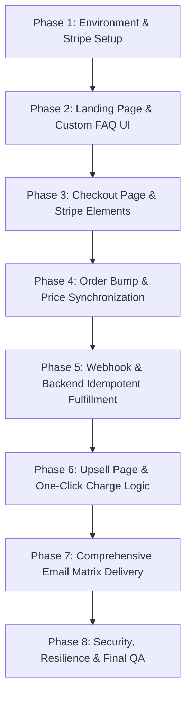

# One Viral Ad Funnel: Complete End-to-End Developer Implementation Specification (new.md)

This document is the absolute source-of-truth step-by-step implementation blueprint to build, deploy, and verify the complete sales funnel. It leaves zero gaps and specifies every detail from UI styling to payment architectures and email fulfillment.

---

## 🗺️ Architectural Phase & Step Sequence



---

## Phase 1: Environment & Stripe Setup

### Step 1: Environment Key Separation
* **Purpose**: Configure Stripe credential isolation to prevent mixing test mode with live credentials.
* **Agent Implementation Prompt**:
  ```text
  Set up and validate environment variables in `.env` and Next.js config. Ensure these variables exist and load:
  - NEXT_PUBLIC_STRIPE_PUBLISHABLE_KEY (either pk_test_... or pk_live_...)
  - STRIPE_SECRET_KEY (either sk_test_... or sk_live_...)
  - STRIPE_WEBHOOK_SECRET (starts with whsec_...)
  - NEXT_PUBLIC_APP_URL (http://localhost:3000 in dev, production domain in prod)
  Add configuration validation logic on application bootstrap to throw a visible warning/error if a test secret key is mixed with a live publishable key (or vice-versa).
  ```
* **Agent Testing Prompt**:
  ```text
  Write a test script or command line fetch that calls /api/create-payment-intent and verify it returns a valid response under test environment credentials. Verify that credentials are not exposed on the client browser.
  ```
* **Bug Finding & Retesting**:
  * *Bug*: Stripe API errors out with `Invalid API Key`.
  * *Fix*: Verify the keys are loaded correctly by logging the prefix (e.g. `sk_test_`) during server start. Never log the full keys.

---

## Phase 2: Landing Page & Custom FAQ UI

### Step 2: Direct-Response Design System
* **Purpose**: Set up custom CSS matching the high-impact streetwear visual guidelines.
* **Agent Implementation Prompt**:
  ```text
  Implement styling in `app/globals.css` using the following palette:
  - Background: Black (#000000)
  - Typography: Large bold poster-style font (e.g., Outfit or Inter Black)
  - Colors: Gold/yellow highlights (#EAB308), red emphasis (#EF4444), green CTAs (#22C55E), white/off-white text (#FAFAFA)
  - Borders: Dark charcoal (#262626)
  Ensure compact, intentional padding and alignment without generic SaaS styling. Apply to the Hero, Benefits ($30/DAY, 60 MINS, NO PRIOR, STREETWEAR OR), and Disclaimer elements.
  ```
* **Agent Testing Prompt**:
  ```text
  Inspect the landing page at multiple responsive widths (320px to 1920px). Ensure there is no horizontal layout overflow and text remains readable.
  ```

### Step 3: Interactive FAQ System with Layout Control
* **Purpose**: Implement the dynamic FAQ accordion behavior described in Section 7.
* **Agent Implementation Prompt**:
  ```text
  Create an FAQ accordion containing 4 items:
  1. What is the One Viral Ad Framework?
  2. Why should I care about this framework?
  3. Is there a guarantee?
  4. Why should I trust you? (This FAQ must contain two proof images side-by-side, preserving their aspect ratios, with a full-screen containment lightbox on click).
  
  Behavior:
  - When an FAQ item opens: hide all hero/top sections above the FAQ. Make the selected FAQ prominent, expand its content, and render an inline "$17 CTA" button within it.
  - Only one FAQ can be open at a time.
  - When the FAQ is closed: restore the hidden hero/landing page contents.
  - Every FAQ purchase CTA must lead to the same checkout flow.
  ```
* **Agent Testing Prompt**:
  ```text
  Click through each FAQ item sequentially. Verify that header content hides/shows accordingly, that only one item stays open, and that clicking the inline CTA immediately scrolls to or reveals the Stripe elements checkout.
  ```

---

## Phase 3: Checkout Page & Stripe Elements

### Step 4: Instant Checkout Entry
* **Purpose**: Ensure that every purchase CTA opens the checkout interface immediately without artificial delay.
* **Agent Implementation Prompt**:
  ```text
  Bind all "$17 CTAs" on the page to immediately display the checkout container. Do not use intermediate loaders or fake transition pages. Ensure the input fields (Name, Email, Phone Number) are interactive immediately while Stripe Elements loads the credit card form frame in the background.
  ```
* **Agent Testing Prompt**:
  ```text
  Simulate slow network speed (Fast 3G) in DevTools. Click a CTA and verify that the checkout wrapper (Name, Email, Phone, Order Bump, Order Summary) renders instantly, and the card field shows a "Loading secure payment form..." message inside its bounding box instead of leaving an empty black space.
  ```

### Step 5: Secure Card Collection via Stripe PaymentElement
* **Purpose**: Use Stripe Elements to securely process credit card details without saving raw data locally.
* **Agent Implementation Prompt**:
  ```text
  Update `components/CheckoutForm.tsx` to utilize `@stripe/react-stripe-js` and `@stripe/stripe-js`. Pass the generated `clientSecret` from `/api/create-payment-intent` to the `<Elements>` provider. Ensure Stripe `PaymentElement` is used instead of legacy individual inputs. Never read, log, or store raw card number, CVC, or card data anywhere in application logs or databases.
  ```
* **Agent Testing Prompt**:
  ```text
  Verify that the Stripe payment form loads securely. Attempt to enter incomplete credentials and confirm that Stripe's built-in validation displays inline validation errors instantly.
  ```

---

## Phase 4: Order Bump & Price Synchronization

### Step 6: Server-Controlled Pricing & Metadata Sync
* **Purpose**: Prevent client-side manipulation of payment amounts and keep Metadata matching the selected offer.
* **Agent Implementation Prompt**:
  ```text
  In `/app/api/create-payment-intent/route.ts` and `/app/api/update-payment-intent/route.ts`:
  1. Enforce strict server-controlled pricing:
     - Bump OFF: Amount = 1700, metadata.transactionType = "framework", metadata.orderBump = "false".
     - Bump ON: Amount = 4400, metadata.transactionType = "framework_sop", metadata.orderBump = "true".
  2. Implement backend validation: Reject requests where the amount is modified client-side. Always derive the amount on the server from the `orderBump` boolean parameter.
  3. When the user checks/unchecks the bump, call the backend update route to patch the existing PaymentIntent's amount and metadata.
  ```
* **Agent Testing Prompt**:
  ```text
  Toggle the order bump ON. Verify the order summary displays $44.00, and the CTA button says "COMPLETE ORDER FOR $44.00 USD". Toggle it OFF. Verify it updates to $17.00. Check Stripe backend dashboard logs to verify the corresponding PaymentIntent amount changes accordingly.
  ```

---

## Phase 5: Webhook & Backend Idempotent Fulfillment

### Step 7: Stripe Webhook Security & Signatures
* **Purpose**: Implement the primary webhook endpoint at `/api/stripe/webhook` validating event signatures.
* **Agent Implementation Prompt**:
  ```text
  Implement `/app/api/stripe/webhook/route.ts`:
  1. Retrieve raw text body of the request (`req.text()`).
  2. Construct the webhook event using `stripe.webhooks.constructEvent(body, signature, STRIPE_WEBHOOK_SECRET)`.
  3. Reject unauthorized / unverified signature requests with status 400.
  4. Route `payment_intent.succeeded` events to the shared fulfillment logic.
  ```
* **Agent Testing Prompt**:
  ```text
  Send a payload to `/api/stripe/webhook` without the `stripe-signature` header. Verify it returns a status 400. Send a valid event triggered via Stripe CLI and verify it returns a 200 response.
  ```

### Step 8: Idempotent Shared Fulfillment Logic
* **Purpose**: Fulfill purchase safely once, even if webhook and manual browser redirection execute simultaneously.
* **Agent Implementation Prompt**:
  ```text
  Create / update `lib/fulfillment.ts`:
  1. Implement `fulfillPurchase(paymentIntent)` as a shared, idempotent function.
  2. Check if `paymentIntent.id` is already stored in the user's `processedIntents` array in MongoDB. If yes, exit cleanly without repeating any side effects (no double emails, no duplicate DB entries).
  3. Validate amount against the transactionType metadata:
     - 1700 -> transactionType must be "framework"
     - 4400 -> transactionType must be "framework_sop"
     - 5700 -> transactionType must be "upsell57"
     If there is a mismatch, log the error and do NOT send any email.
  4. Record the purchase inside the User document under `purchasedItems`.
  ```
* **Agent Testing Prompt**:
  ```text
  Concurrently execute both the redirect callback handler `/api/verify-payment` and a webhook post mimicking `payment_intent.succeeded` with the same intent ID. Check MongoDB to verify that the email was sent only once and the processed intent is stored.
  ```

---

## Phase 6: Upsell Page & One-Click Charge Logic

### Step 9: Redirect & Upsell Offer UI
* **Purpose**: Securely redirect users after an initial purchase to `/upsell` showing the $57 offer.
* **Agent Implementation Prompt**:
  ```text
  Once the $17 or $44 purchase succeeds, redirect the user to `/upsell`.
  Display details matching the spec:
  - Header: "YOUR ORDER IS SUCCESSFUL!" and "Please check your email to gain access to your purchase."
  - Section: "ONE-TIME OFFER"
  - Upsell Headline: "BUILD YOUR VIRAL AD WITH US"
  - Urgency Badge: "IN THE NEXT 24 HOURS"
  - Pricing: $57 USD
  - CTA Button: "YES! BUILD MY VIRAL AD WITH YOU – $57 USD"
  ```
* **Agent Testing Prompt**:
  ```text
  Complete a checkout test transaction. Verify the browser redirects to `/upsell` showing the correct messages.
  ```

### Step 10: One-Click Charging Backend (Customer Card Reuse)
* **Purpose**: Instantly charge the saved card for the $57 upsell without re-entering details.
* **Agent Implementation Prompt**:
  ```text
  Implement `/app/api/create-upsell-payment/route.ts`:
  1. Receive `originalPaymentIntentId`.
  2. Fetch original PaymentIntent to retrieve `customer` ID and `payment_method` ID.
  3. Create and confirm a separate PaymentIntent with:
     - amount: 5700
     - customer: original customer ID
     - payment_method: original saved payment method ID
     - off_session: true
     - confirm: true
     - metadata.transactionType: "upsell57"
     - metadata.originalPaymentIntentId: originalPaymentIntentId
  4. Use a Stripe Idempotency Key: `upsell_<originalPaymentIntentId>` on the create request to prevent double charges.
  ```
* **Agent Testing Prompt**:
  ```text
  Submit a test upsell payment. Verify in Stripe logs that a second transaction for $57 is executed successfully using the same customer ID, and that double-clicking the button fails safely due to the idempotency key constraint.
  ```

---

## Phase 7: Comprehensive Email Matrix Delivery

### Step 11: Email Selection & Exact Content Triggering
* **Purpose**: Send the exact content template required and prevent duplicate templates.
* **Agent Implementation Prompt**:
  ```text
  Implement the exact body copy and subject lines inside `lib/emailTemplate.ts`:
  - **EMAIL #1 ($17 Offer)**:
    - Subject: Your One Viral Ad Framework
    - Body:
      "Thank you for your purchase and for trusting me.
      
      Please click the link below to access the One Viral Ad Framework.
      
      https://drive.google.com/drive/folders/1enjOKGdNzdN6E36fnz3-ho_kETd2yqSN
      
      Cheers,
      Yasir"
  - **EMAIL #2 ($44 Offer)**:
    - Subject: Your One Viral Ad Framework + SOP
    - Body:
      "Thank you for your purchase and for trusting me.
      
      Please click the link below to access the One Viral Ad Framework and the SOP.
      
      https://drive.google.com/drive/folders/1D0HstKyzE2ZFq6ODvBHA0seXKvIUSakI
      
      Cheers,
      Yasir"
  - **EMAIL #3 ($57 Upsell)**:
    - Subject: Build Your Viral Ad With Us in 24 Hours!
    - Body:
      "Thank you for your purchase and for trusting me.
      
      We’ll be soon adding you to our Slack workspace, using the email address you provided during checkout.
      
      If you’d prefer us to use a different email address, simply reply to this email with the one you’d like us to use.
      
      Your 24 hours will begin once you’ve been added to Slack and we’ve exchanged greetings.
      
      You’ll be notified of the exact time your 24 hours begin.
      
      Talk soon,
      Yasir"
      
  Enforce the Matrix:
  - $17 only -> EMAIL #1 only.
  - $44 only -> EMAIL #2 only (never send EMAIL #1 + EMAIL #2).
  - $17 + $57 -> EMAIL #1 + EMAIL #3.
  - $44 + $57 -> EMAIL #2 + EMAIL #3.
  ```
* **Agent Testing Prompt**:
  ```text
  Run test transactions for all 4 scenarios. Check your mailcatcher/inbox logs to verify that the correct emails are sent and that $44 buyers NEVER receive the $17 email template.
  ```

---

## Phase 8: Security, Resilience & Final QA

### Step 12: Recovery & Error Handling (Failure Tests)
* **Purpose**: Make the application robust against failures, network drops, and browser interrupts.
* **Agent Implementation Prompt**:
  ```text
  Implement safety tests and error pages:
  1. If a customer pays $17/$44 and immediately closes their browser before redirection, ensure the Webhook still successfully delivers the email (Interrupted Browser Scenario).
  2. If the $57 upsell fails, show an upsell-specific payment error but do NOT revoke the user's initial $17/$44 purchase or access.
  3. Prevent browser refresh loops from sending duplicate emails by checking `sentEmails` array before dispatching SMTP mails.
  ```
* **Agent Testing Prompt**:
  ```text
  1. Complete a payment flow and terminate the browser instance immediately. Confirm that the webhook succeeds and sends the fulfillment email.
  2. Simulate an upsell failure (using a card that declines on the second transaction). Verify the UI shows the failure message, but the user is still verified for the initial purchase.
  ```
